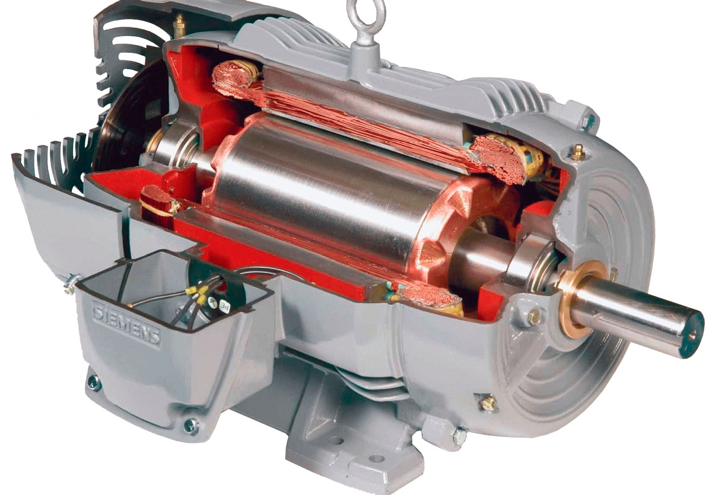

<!DOCTYPE html>
<html lang="en">
<head>
    <meta charset="UTF-8">
    <meta name="viewport" content="width=device-width, initial-scale=1.0">
    <title>Engine Viewer</title>
</head>
<body>
    

        <h1>Какой-то двигатель</h1>
        
        <button id="ok">Я понял</button>
    

    
</body>
</html>
